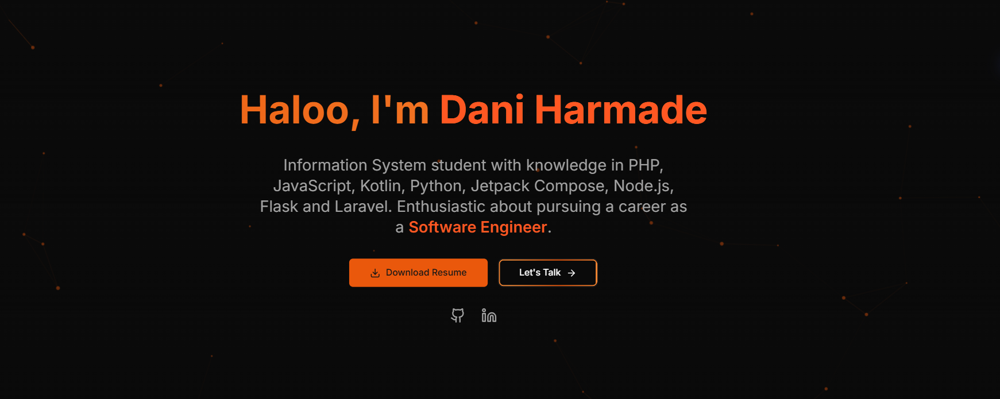

# 🌐 Dani Harmade | Portfolio Website



<div align="center">

[](https://nextjs.org/)
[](https://www.typescriptlang.org/)
[](https://tailwindcss.com/)
[](https://www.framer.com/motion/)

</div>

---

## 🚀 About The Project

Website portofolio modern yang dirancang dengan tema **Cyberpunk / Web3**. Dibangun untuk menampilkan pengalaman, proyek, dan pencapaian dengan cara yang interaktif dan imersif.

Menggunakan kombinasi **Glassmorphism**, **Neon Glows**, dan **3D Interactions** untuk menciptakan pengalaman pengguna yang unik, berbeda dari portofolio statis biasa.

### 🎨 Key Features

*   **Atmospheric Hero Section:** Latar belakang partikel dinamis dengan efek lantai 3D grid yang memberikan kedalaman visual.
*   **Futuristic Navigation:** Navbar model *floating capsule* dengan efek *frosted glass* dan indikator aktif yang responsif.
*   **Interactive Timeline:** Riwayat pendidikan ditampilkan dalam bentuk node jaringan vertikal.
*   **Terminal Style Cards:** Bagian pengalaman kerja dan bootcamp didesain menyerupai antarmuka *command line* / terminal.
*   **Holographic Projects:** Kartu proyek dengan efek *scanline* dan carousel gambar kustom.
*   **Secure Contact Form:** Formulir kontak bertema "Encrypted Transmission" dengan widget radar lokasi.
*   **Verified Certificates:** Efek *laser scanning* pada sertifikat untuk simulasi verifikasi aset digital.
*   **Fully Responsive:** Tampilan yang optimal dari perangkat mobile hingga desktop.

---

## 🛠️ Tech Stack

Project ini dibangun menggunakan teknologi terkini:

*   **Framework:** [Next.js 14](https://nextjs.org/) (App Router)
*   **Language:** [TypeScript](https://www.typescriptlang.org/)
*   **Styling:** [Tailwind CSS](https://tailwindcss.com/)
*   **Animations:** [Framer Motion](https://www.framer.com/motion/)
*   **Icons:** [Lucide React](https://lucide.dev/)
*   **Particles:** [TSParticles](https://particles.js.org/)
*   **Carousel:** [Embla Carousel](https://www.embla-carousel.com/)
*   **Forms:** [React Hook Form](https://react-hook-form.com/) + [Zod](https://zod.dev/)

---

## 💻 Getting Started

Ikuti langkah-langkah di bawah ini untuk menjalankan proyek di komputer lokal Anda.

### Prerequisites

Pastikan Anda telah menginstal **Node.js** (versi 18 atau lebih baru).

### Installation

1.  **Clone repository**
    ```bash
    git clone https://github.com/username-anda/nama-repo.git
    cd nama-repo
    ```

2.  **Install dependencies**
    ```bash
    npm install
    # atau jika menggunakan yarn
    yarn install
    # atau jika menggunakan pnpm
    pnpm install
    ```

3.  **Jalankan Development Server**
    ```bash
    npm run dev
    ```

4.  Buka browser dan akses `http://localhost:3000`.

---

## ⚙️ Customization

### Mengubah Data Konten
Seluruh data teks (Pengalaman, Project, Sertifikat, dll) disimpan dalam file konstanta agar mudah diubah tanpa menyentuh kode UI.

*   Lokasi file: `app/constants/index.ts` (atau sesuaikan dengan struktur folder Anda).

### Mengubah Warna Tema
Warna utama (Primary Orange) diatur menggunakan variabel CSS dan konfigurasi Tailwind.

*   **Primary Color:** `rgb(255, 87, 34)` / `#FF5722`
*   Untuk mengubahnya, edit file `tailwind.config.ts` atau `globals.css`.

### Setup Form Kontak
Formulir menggunakan layanan **Formspree**.
1.  Buat akun di [Formspree](https://formspree.io/).
2.  Buat form baru dan salin endpoint URL.
3.  Buka file `components/Contact.tsx`.
4.  Ganti variabel `FORM_ENDPOINT` dengan URL milik Anda.

---

## 📸 Preview

Pastikan Anda menyimpan screenshot website Anda dengan nama `bannerp.png` di dalam folder `public/` agar gambar muncul di bagian atas README ini.

---

## 📄 License

Distributed under the MIT License. See `LICENSE` for more information.

---

<p align="center">
  Created with 🧡 by <strong>Dani Harmade</strong>
</p>